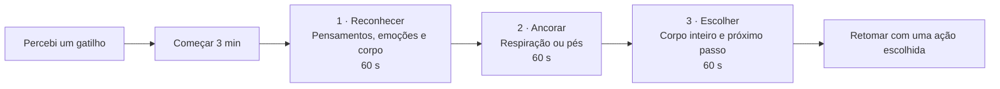

# ROADMAP — CoreFlow

**Atualizado em:** 12/09/2026.

**Solicitação atual:** [semana/sessão correta, ampliação do Bracing e backup na Evolução](#12-semanas-sessões-bracing-e-backup-na-evolução). Semana/sessão, ajuste manual, Bracing de oito semanas e backup/importação implementados localmente; testes automatizados aprovados e validação Android em andamento.

**Prioridade crítica:** [investigação e correção da perda de progresso](#11-incidente-de-perda-de-progresso--diagnóstico-e-plano-de-correção). Correção preventiva implementada e validada em build debug em 11/09/2026; a causa inicial e a recuperação do histórico já sobrescrito no aparelho ainda dependem da inspeção do dispositivo.

**Nova entrega:** [Pausa de Resposta — Espaço de Respiração de 3 Minutos](#10-pausas--pausa-de-resposta-de-3-minutos), com roteiro para uso no banco, acompanhamento visual e histórico local opcional. **Implementação funcional concluída; validação física em aparelho pendente.**

## Vibração dos exercícios no Galaxy Watch

**Status:** implementação concluída em 08/09/2026; validação física pendente por não haver dispositivo ADB conectado.
**Objetivo:** cada sinal de vibração do exercício no celular também gerar um sinal no relógio, com o menor atraso possível.

1. **Compatibilidade adotada:** Galaxy Watch4 ou mais recente com Wear OS. Relógios Tizen exigem outra implementação.
2. **Mapear eventos existentes:** revisar `MainActivity.kt` (bridge `vibrate`/`vibratePattern` e outros efeitos), `WorkoutForegroundService.kt` e o HTML. Centralizar os sinais dos exercícios para cobrir início, transições e término sem duplicações.
3. **Criar módulo Wear OS:** aplicativo mínimo instalado no relógio, com permissão `VIBRATE`, mesmo applicationId e certificado de assinatura do app do celular. Receber comandos via Wearable Data Layer (`MessageClient`/`WearableListenerService`) e executar padrões compatíveis com o hardware.
4. **Conectar os dispositivos:** descobrir o relógio com o app instalado usando `CapabilityClient`. Enviar eventos com versão do protocolo, sessão, identificador, padrão e prazo curto de validade. Descartar duplicados e eventos atrasados; não reproduzir uma fila antiga ao reconectar. O celular continua funcionando sem relógio.
5. **Adicionar configuração:** opção “Vibrar também no relógio”, estado da conexão e botão de teste. Respeitar a preferência de vibração do usuário; definir e validar o comportamento com Não Perturbe. Pausar/encerrar deve cancelar padrões pendentes em ambos os dispositivos.
6. **Validar em aparelhos reais:** telas apagadas, app em segundo plano, treino completo, desconexão/reconexão, bateria e cancelamento. Medir o atraso entre celular e relógio: meta inicial de até 300 ms em 95% dos sinais com conexão local estável, a confirmar nos testes; não prometer simultaneidade exata.
7. **Entregar depois:** gerar APKs release versionados para celular e relógio, preservar assinatura e dados do celular e documentar instalação, pareamento e teste. Publicar quando a implementação estiver concluída.

**Aceite automatizado concluído:** módulos celular e Wear compilam, usam o mesmo applicationId, versão e certificado; envio é opcional, não bloqueia o treino, descarta mensagens com mais de 5 segundos e elimina duplicações. **Pendente:** confirmar vibração e latência em um Galaxy Watch real.

**Referências:** [Data Layer e requisitos de assinatura](https://developer.android.com/training/wearables/data/overview), [tipos de cliente](https://developer.android.com/training/wearables/data/client-types). Não presumir que o espelhamento de notificações replica os comandos de vibração dos exercícios.

---

# ROADMAP DE IMPLEMENTAÇÃO: PROGRAMA DE 8 SEMANAS DE MINDFULNESS (ATENÇÃO PLENA)
**Projeto:** CoreFlow Android App (`C:\Users\fael\Downloads\Adbm`)  
**Módulo:** Programas de Treinamento (`#tab-programas`) & Player de Áudio Guiado  
**Público-Alvo:** Agente Autônomo / Desenvolvedor (Codex)  
**Versão do Documento:** 1.0.0  
**Status:** PRONTO PARA EXECUÇÃO

---

## 1. Visão Geral e Objetivo

Implementar de ponta a ponta o **Programa de 8 Semanas de Mindfulness (Atenção Plena)** (baseado no protocolo canônico de Mark Williams & Danny Penman / Mindfulness-Based Cognitive Therapy - MBCT) dentro da aba **Programas** do CoreFlow.

O programa é estruturado em:
1. **8 Semanas Progressivas** com práticas formais em áudio (`1track.mp3` a `8track.mp3`) e práticas informais diárias no cotidiano.
2. **Player de Áudio Dedicado com Suporte a Foreground Service**: reprodução contínua mesmo com tela bloqueada ou app em segundo plano, controles de play/pause, scrub de progresso, avanço/retrocesso de 15s.
3. **Acompanhamento e Registro de Hábitos**: contador de sessões diárias (ex: 2x ao dia nas semanas 1-3; 1x formal + 2-3x Espaço de Respiração nas semanas 4-8), checklist de prática informal da semana e streak persistido no `localStorage`.

---

## 2. Inventário e Mapeamento dos Arquivos de Áudio

O usuário possui 8 faixas de áudio no celular. A estrutura de assets no projeto deve ser:
`app/src/main/assets/audio/mindfulness/`

| Arquivo Fonte | Nome Canônico no App | Título da Meditação | Duração Aprox. | Semanas de Uso | Frequência Prescrita |
| :--- | :--- | :--- | :--- | :--- | :--- |
| `1track.mp3` | `1track.mp3` | Meditação do Corpo e da Respiração | ~8 min | Semana 1, Semana 3 (alternada), Semana 7 (opção) | Sem 1: 2x/dia (6 dias/sem) |
| `2track.mp3` | `2track.mp3` | Escaneamento Corporal (Body Scan) | ~14 min | Semana 2, Semana 7 (opção) | Sem 2: 2x/dia (6 dias/sem) |
| `3track.mp3` | `3track.mp3` | Movimento Consciente | ~8 min | Semana 3, Semana 7 (opção) | Sem 3: 1x/dia intercalada |
| `4track.mp3` | `4track.mp3` | Respiração e Movimento Estendido | ~10 min | Semana 3 (opção), Semana 7 (opção) | Suporte |
| `5track.mp3` | `5track.mp3` | Sons e Pensamentos | ~8 min | Semana 4, Semana 7 (opção) | Sem 4: 1x/dia (6 dias/sem) |
| `6track.mp3` | `6track.mp3` | Explorando a Dificuldade | ~10 min | Semana 5, Semana 7 (opção) | Sem 5: 1x/dia (6 dias/sem) |
| `7track.mp3` | `7track.mp3` | Meditação da Amizade e Gentileza | ~10 min | Semana 6, Semana 7 (opção) | Sem 6: 1x/dia (6 dias/sem) |
| `8track.mp3` | `8track.mp3` | Espaço de Respiração de 3 Minutos | ~3 min | Semanas 3, 4, 5, 6, 7, 8 | 2 a 3x ao dia + SOS quando notar tensão |

> **Nota de Compatibilidade:** O player deve suportar tanto caminhos de asset local (`audio/mindfulness/{track}`) quanto seleção via `AndroidBridge` / input file caso o usuário aponte para a pasta de downloads do aparelho.

---

## 3. Matriz Pedagógica das 8 Semanas

### Semana 1: Acordando do Piloto Automático
- **Foco:** Interromper ações mecânicas do cotidiano e perceber o fluxo disperso da mente.
- **Prática Formal:** Áudio 1 (`1track.mp3` - Meditação do Corpo e da Respiração, ~8 min) realizada **2x ao dia**, durante **6 dias** da semana.
- **Prática Informal:** Comer com Atenção Plena (escolher uma refeição ou fruta por dia e saborear texturas, cheiros e mastigação consciente) + quebra de rotina mecânica (ex: sentar em cadeira diferente, escovar os dentes com a mão não dominante).

### Semana 2: Conectando-se ao Corpo
- **Foco:** Reintegração aos sinais físicos, descompressão somática e liberação de tensões acumuladas.
- **Prática Formal:** Áudio 2 (`2track.mp3` - Escaneamento Corporal, ~14 min) realizada **2x ao dia**, durante **6 dias** da semana.
- **Prática Informal:** Executar uma atividade diária comum com foco sensorial total no corpo (ex: sentir a temperatura da água no banho, o toque na louça ou o caminhar até o trabalho).

### Semana 3: O Corpo em Movimento
- **Foco:** Integrar atenção plena ao movimento físico e aprender a pausar nos momentos de agitação.
- **Prática Formal:** Áudio 3 (`3track.mp3` - Movimento Consciente, ~8 min) alternando dias com Áudio 1 (`1track.mp3`), **1x ao dia**, durante **6 dias**.
- **Prática Complementar:** Introdução do Áudio 8 (`8track.mp3` - Espaço de Respiração de 3 Minutos) **2x ao dia** (manhã e tarde).
- **Prática Informal:** Caminhada consciente de 15 a 30 minutos (notando o impacto dos calcanhares, a brisa e o ritmo respiratório).

### Semana 4: Sons e Pensamentos
- **Foco:** Reconhecer que "pensamentos não são fatos" e observar a mente como o céu que acolhe nuvens passageiras.
- **Prática Formal:** Áudio 5 (`5track.mp3` - Sons e Pensamentos, ~8 min) realizada **1x ao dia**, durante **6 dias**.
- **Prática Complementar:** Áudio 8 (`8track.mp3` - Espaço de Respiração) **2x ao dia** em horários programados.
- **Prática Informal:** Notar momentos de ruminação ou preocupação no trabalho e aplicar imediatamente a âncora respiratória.

### Semana 5: Explorando a Dificuldade
- **Foco:** Aprender a virar-se em direção ao desconforto em vez de fugir ou lutar contra ele.
- **Prática Formal:** Áudio 6 (`6track.mp3` - Explorando a Dificuldade, ~10 min) realizada **1x ao dia**, durante **6 dias**.
- **Prática Complementar:** Áudio 8 (`8track.mp3` - Espaço de Respiração de Resposta) no exato instante em que notar estresse agudo, irritação ou frustração.
- **Prática Informal:** Localizar a manifestação física das emoções difíceis (aperto na garganta, peso no estômago, mandíbula travada) e respirar através dessa área.

### Semana 6: Acolhimento e Compaixão
- **Foco:** Dissolver a autocrítica severa e cultivar amabilidade para consigo mesmo e para com os outros.
- **Prática Formal:** Áudio 7 (`7track.mp3` - Meditação da Amizade e Gentileza, ~10 min) realizada **1x ao dia**, durante **6 dias**.
- **Prática Complementar:** Áudio 8 (`8track.mp3` - Espaço de Respiração) **2 a 3x ao dia**.
- **Prática Informal:** Praticar um ato deliberado de gentileza ou apreço genuíno (anônimo ou expresso) a cada dia.

### Semana 7: O Ritmo do Cotidiano
- **Foco:** Integração do mindfulness na rotina de longo prazo; mapeamento de fontes de esgotamento e restauração.
- **Prática Formal:** Escolha pessoal da meditação favorita das semanas anteriores (Áudios 1, 2, 3, 5, 6 ou 7), de 10 a 15 min, **1x ao dia**, durante **6 dias**.
- **Prática Complementar:** Áudio 8 (`8track.mp3` - Espaço de Respiração) **3x ao dia**.
- **Prática Informal:** Mapeamento diário de "Atividades Nutritivas" (que recarregam energia) versus "Atividades Exaustivas" (que drenam), ajustando o dia intencionalmente.

### Semana 8: Sua Vida Selvagem e Preciosa
- **Foco:** Consolidação da autonomia, tecendo a atenção plena como um hábito vivo para o resto da vida.
- **Prática Formal:** Prática pessoal diária (10 a 20 min guiada ou em silêncio ancorada na respiração), **6 dias**.
- **Prática Complementar:** Áudio 8 (`8track.mp3` - Espaço de Respiração) usado sob demanda como recurso de ancoragem contínua.
- **Prática Informal:** Criação do "Plano de Manutenção e Prevenção de Recaída" (identificar sinais precoces de exaustão mental e o protocolo de retorno imediato).

---

## 4. Arquitetura de Dados no `index.html`

### 4.1 Elevação de Versão do Esquema
- No topo dos scripts de `index.html`, atualizar:
  ```javascript
  const CORE_DATA_VERSION = 3; // Anteriormente 2
  ```
- No método `loadSavedState()`:
  - Garantir que a migração adicione o programa `id: '4'` preservando integralmente o progresso dos programas `1` (Bracing), `2` (Kegel) e `3` (Vacuum).
  - Validar a existência do programa `id: '4'` no array `AppState.programs`. Se inexistente, instanciar a estrutura padrão.

### 4.2 Definição do Objeto no `AppState.programs`
Inserir no array inicial de programas:
```javascript
{
  id: '4',
  type: 'mindfulness',
  title: 'Mindfulness 8 Semanas',
  subtitle: 'Atenção Plena & Redução de Estresse (MBCT)',
  icon: 'brain',
  color: '#8B5CF6', // Roxo profundo / violeta meditativo
  gradient: 'linear-gradient(135deg, #7C3AED 0%, #4C1D95 100%)',
  weeklyTargetDays: 6,
  currentPhaseIndex: 0,
  daysCompletedInPhase: 0,
  sessionsToday: 0,
  lastCompletedDate: null,
  reminderEnabled: true,
  reminderTime: '07:30',
  secondaryReminderTime: '15:30', // Para o 2º turno ou Espaço de Respiração
  informalCompletedToday: false,
  phases: [
    {
      weekNumber: 1,
      name: 'Semana 1: Acordando do Piloto Automático',
      description: 'Reconheça a dispersão mecânica do dia a dia e ancore-se no presente.',
      targetSessionsPerDay: 2,
      targetDaysPerWeek: 6,
      formalTrack: 'audio/mindfulness/1track.mp3',
      formalTrackTitle: 'Meditação do Corpo e da Respiração',
      formalTrackDuration: 480, // ~8 minutos em segundos
      secondaryTrack: null,
      informalTitle: 'Refeição Consciente & Quebra de Padrão',
      informalDescription: 'Escolha uma refeição ou fruta para saborear com atenção plena (cheiro, textura, mastigação) e altere um hábito mecânico simples hoje.'
    },
    {
      weekNumber: 2,
      name: 'Semana 2: Conectando-se ao Corpo',
      description: 'Reintegração física e liberação profunda de tensões acumuladas.',
      targetSessionsPerDay: 2,
      targetDaysPerWeek: 6,
      formalTrack: 'audio/mindfulness/2track.mp3',
      formalTrackTitle: 'Escaneamento Corporal (Body Scan)',
      formalTrackDuration: 840, // ~14 min
      secondaryTrack: null,
      informalTitle: 'Atenção Sensorial no Cotidiano',
      informalDescription: 'Execute uma tarefa automática diária (banho, escovar os dentes ou lavar louça) sentindo 100% das sensações físicas em tempo real.'
    },
    {
      weekNumber: 3,
      name: 'Semana 3: O Corpo em Movimento',
      description: 'Atenção em ação e introdução do Espaço de Respiração.',
      targetSessionsPerDay: 1,
      targetDaysPerWeek: 6,
      formalTrack: 'audio/mindfulness/3track.mp3',
      formalTrackTitle: 'Movimento Consciente (ou Áudio 1)',
      formalTrackDuration: 480,
      secondaryTrack: 'audio/mindfulness/8track.mp3',
      secondaryTrackTitle: 'Espaço de Respiração (3 min)',
      secondaryTrackDuration: 180,
      informalTitle: 'Caminhada Consciente',
      informalDescription: 'Caminhe de 15 a 30 minutos prestando atenção nas sensações dos pés tocando o solo, na postura e no contato com o ar.'
    },
    {
      weekNumber: 4,
      name: 'Semana 4: Sons e Pensamentos',
      description: 'Pensamentos não são fatos. Observe o fluxo da mente sem apego.',
      targetSessionsPerDay: 1,
      targetDaysPerWeek: 6,
      formalTrack: 'audio/mindfulness/5track.mp3',
      formalTrackTitle: 'Meditação dos Sons e Pensamentos',
      formalTrackDuration: 480,
      secondaryTrack: 'audio/mindfulness/8track.mp3',
      secondaryTrackTitle: 'Espaço de Respiração (2x ao dia)',
      secondaryTrackDuration: 180,
      informalTitle: 'Pausa Anti-Ruminação',
      informalDescription: 'Sempre que notar uma espiral de preocupações ou julgamentos, pause, faça uma respiração profunda e reconecte-se com o corpo.'
    },
    {
      weekNumber: 5,
      name: 'Semana 5: Explorando a Dificuldade',
      description: 'Acolha o desconforto e aprenda a respirar através das tensões.',
      targetSessionsPerDay: 1,
      targetDaysPerWeek: 6,
      formalTrack: 'audio/mindfulness/6track.mp3',
      formalTrackTitle: 'Explorando a Dificuldade',
      formalTrackDuration: 600, // ~10 min
      secondaryTrack: 'audio/mindfulness/8track.mp3',
      secondaryTrackTitle: 'Espaço de Respiração de Resposta',
      secondaryTrackDuration: 180,
      informalTitle: 'Mapeamento do Desconforto Somático',
      informalDescription: 'Ao vivenciar irritação ou ansiedade, localize onde o corpo está reagindo (peito, garganta, estômago) e acolha sem reagir.'
    },
    {
      weekNumber: 6,
      name: 'Semana 6: Acolhimento e Compaixão',
      description: 'Cultive bondade amorosa, amizade e dissolva a autocrítica.',
      targetSessionsPerDay: 1,
      targetDaysPerWeek: 6,
      formalTrack: 'audio/mindfulness/7track.mp3',
      formalTrackTitle: 'Meditação da Amizade e Gentileza',
      formalTrackDuration: 600,
      secondaryTrack: 'audio/mindfulness/8track.mp3',
      secondaryTrackTitle: 'Espaço de Respiração (2-3x ao dia)',
      secondaryTrackDuration: 180,
      informalTitle: 'Ato Deliberado de Gentileza',
      informalDescription: 'Realize um ato genuíno de gentileza sem esperar nada em troca, prestando atenção em como isso ressoa no seu estado interior.'
    },
    {
      weekNumber: 7,
      name: 'Semana 7: O Ritmo do Cotidiano',
      description: 'Personalize sua prática e mapeie fontes de renovação de energia.',
      targetSessionsPerDay: 1,
      targetDaysPerWeek: 6,
      formalTrack: 'audio/mindfulness/1track.mp3',
      formalTrackTitle: 'Sua Prática Favorita (Áudios 1, 2, 3, 5, 6 ou 7)',
      formalTrackDuration: 600,
      secondaryTrack: 'audio/mindfulness/8track.mp3',
      secondaryTrackTitle: 'Espaço de Respiração (3x ao dia)',
      secondaryTrackDuration: 180,
      informalTitle: 'Atividades Nutritivas vs Exaustivas',
      informalDescription: 'Classifique seus compromissos de hoje entre os que nutrem sua energia e os que drenam. Adicione uma pausa reparadora consciente.'
    },
    {
      weekNumber: 8,
      name: 'Semana 8: Sua Vida Selvagem e Preciosa',
      description: 'Consolidação da autonomia e mindfulness para a vida inteira.',
      targetSessionsPerDay: 1,
      targetDaysPerWeek: 6,
      formalTrack: 'audio/mindfulness/1track.mp3',
      formalTrackTitle: 'Prática Autônoma Consolidada (10-20 min)',
      formalTrackDuration: 600,
      secondaryTrack: 'audio/mindfulness/8track.mp3',
      secondaryTrackTitle: 'Espaço de Respiração SOS',
      secondaryTrackDuration: 180,
      informalTitle: 'Plano de Prevenção de Recaída',
      informalDescription: 'Defina suas 3 âncoras para quando o estresse subir: qual áudio ouvir, como pausar e quem procurar para desacelerar.'
    }
  ]
}
```

---

## 5. Implementação da Interface e do Player de Áudio

### 5.1 Card na Aba Programas (`renderProgramsList()`)
- O card do programa deve renderizar:
  - **Badge de Categoria:** `Mindfulness & Mente` (gradiente roxo/violeta).
  - **Fase Atual:** `Semana X de 8: Nome da Semana`.
  - **Barra de Progresso:** Dias completados / meta semanal (6 dias).
  - **Prática Informal da Semana:** Card colapsável com ícone de lâmpada/folha e botão toggle para marcar se a prática informal de hoje foi concluída.
  - **Ações Rápidas:**
    - Botão primário: **Iniciar Prática Formal** (Abre o Player do Áudio da Semana).
    - Botão secundário (a partir da Semana 3): **Espaço de Respiração (3 min)** (Áudio 8 direto).

### 5.2 Modal do Player de Áudio (`openMindfulnessAudioModal(progId, phaseIdx, trackType)`)
O modal de execução para treinos de mindfulness deve ser otimizado para audição consciente:
- **Design:** Fundo escuro imersivo, gradiente suave, ilustração de onda sonora ou pulsação suave sincronizada com o timer.
- **Controles de Reprodução:**
  - Botão Play / Pause central amplo.
  - Botão Retroceder 15s (`-15s`).
  - Botão Avançar 15s (`+15s`).
  - Barra de Progresso Interativa (Slider/Scrubber) com tempo decorrido e tempo restante.
  - Seletor de Faixa (para Semanas 3 e 7 que oferecem alternância).
- **WakeLock & Background Playback:**
  - Ativar `navigator.wakeLock.request('screen')` enquanto o áudio estiver tocando.
  - Integrar com `AndroidBridge.startWorkoutSession("Mindfulness: " + trackTitle, totalSeconds)` para manter o serviço de primeiro plano ativo e não ser interrompido pelo Doze Mode do Android.
- **Ao Finalizar o Áudio:**
  - Tocar suavemente som de sino tibetano / gongo.
  - Registrar conclusão: incrementar `sessionsToday` e `daysCompletedInPhase`.
  - Disparar confetes ou feedback visual suave de conquista com botão de salvar diário/sensações.

---

## 6. Integração Nativa Android (`MainActivity.kt` & `WorkoutForegroundService.kt`)

1. **Ativos no Projeto:**
   - Criar a pasta: `app/src/main/assets/audio/mindfulness/`
   - Alocar os arquivos `1track.mp3` até `8track.mp3`.
   - Se os arquivos ainda não estiverem na árvore do repositório, o app deve conter um seletor no WebView que permita ao usuário carregar uma vez do armazenamento do celular e salvar no IndexedDB ou cache de arquivos do app.

2. **Permissões e Background Audio:**
   - Garantir que o `AndroidManifest.xml` contenha:
     ```xml
     <uses-permission android:name="android.permission.FOREGROUND_SERVICE" />
     <uses-permission android:name="android.permission.FOREGROUND_SERVICE_MEDIA_PLAYBACK" />
     <uses-permission android:name="android.permission.WAKE_LOCK" />
     ```
   - No `WorkoutForegroundService.kt`:
     - O tipo de serviço deve incluir `mediaPlayback` ou manter a notificação persistente com controle de mídia caso o áudio seja tocado via MediaPlayer nativo ou WebView.

3. **Fallback Resiliente de Áudio no WebView:**
   ```javascript
   function createMindfulnessAudio(trackPath) {
     const audio = new Audio(trackPath);
     audio.preload = 'auto';
     return audio;
   }
   ```

---

## 7. Sistema de Notificações e Lembretes Diários

1. **Lembrete Formal Principal:**
   - Configurado por padrão para as `07:30` (ou customizado pelo usuário).
   - Texto: *"Momento Mindfulness: Sua prática de [Nome da Meditação] espera por você hoje."*
2. **Lembrete do Espaço de Respiração (Semanas 3 a 8):**
   - Configurado para as `15:30` (momento de pico de tensão vespertina).
   - Texto: *"Pausa de 3 Minutos: Saia do piloto automático e respire fundo."*
3. **Persistência via `AndroidBridge.scheduleWorkoutNotification`**.

---

## 8. Roteiro Passo a Passo de Execução para o Codex

### Etapa 1: Preparação e Assets
1. Criar o diretório de assets:
   `app/src/main/assets/audio/mindfulness/`
2. Copiar/alocar as 8 faixas (`1track.mp3` a `8track.mp3`).
3. Verificar a permissão de leitura de assets no `MainActivity.kt`.

### Etapa 2: Atualização do Esquema no `index.html`
1. Incrementar `CORE_DATA_VERSION = 3`.
2. Adicionar a definição canônica do Programa 4 com as 8 semanas completas, metadados de áudio e práticas informais.
3. No `loadSavedState()`, implementar o merge garantindo que se o programa `id === '4'` não existir na lista salva, ele seja inserido sem zerar os outros.

### Etapa 3: Desenvolvimento do Player de Mindfulness no `index.html`
1. Adicionar os estilos CSS para o Player de Áudio Imersivo (`.mindfulness-player-modal`, `.audio-scrubber`, `.pulsing-glow`).
2. Implementar a função `openMindfulnessAudioModal(programId, phaseIndex, isSecondary)`:
   - Carregamento da faixa via HTML5 Audio.
   - Atualização do tempo em tempo real (display `mm:ss` / `-mm:ss`).
   - Listeners para `timeupdate`, `ended`, `error`.
   - Controles de play, pause, avançar 15s, retroceder 15s.
   - Ativação do Foreground Service via `AndroidBridge`.
3. Adicionar o checklist da Prática Informal com botão de marcação diária.

### Etapa 4: Renderização na Aba Programas
1. Atualizar `renderProgramsList()` para reconhecer o `type: 'mindfulness'`.
2. Exibir o card com badge violeta, botões de ação específicos (Prática Formal + Espaço de Respiração) e a dica informal da semana em destaque.

### Etapa 5: Validação e Testes
1. Executar testes de compatibilidade em JavaScript (Node.js/JSDOM ou no navegador).
2. Compilar o app via Gradle:
   `./gradlew.bat assembleRelease`
3. Instalar o APK de release no dispositivo ou emulador e validar:
   - Reprodução das 8 faixas.
   - Continuidade do áudio com tela desligada (Foreground Service).
   - Contagem correta dos 6 dias por semana e avanço de fase.
   - Preservação intacta dos programas 1, 2 e 3.

---

## 9. Critérios de Aceite (Definition of Done)

- [ ] Programa `id: '4'` acessível na aba Programas com todas as 8 semanas detalhadas.
- [ ] Todas as 8 faixas de áudio vinculadas e funcionais no player.
- [ ] O áudio continua tocando com a tela apagada (Foreground Service / WakeLock ativo).
- [ ] O usuário consegue marcar tanto a prática formal quanto a prática informal diária.
- [ ] Migração de versão (`CORE_DATA_VERSION = 3`) preserva os dados existentes sem resetar treinos anteriores.
- [ ] Build Gradle (`assembleRelease`) conclui com sucesso com exit code 0.
- [ ] APK release gerado e pronto para sincronização.

---

## 10. Pausas — Pausa de Resposta de 3 Minutos

**Status:** card, roteiro, sessão visual, modo discreto, escolha final e histórico local implementados em 10/09/2026. Build debug concluído; validação física em aparelho pendente.

**Destino:** aba **Pausas** (`#tab-pausas`), junto ao bloco **Mente**, com acesso rápido mesmo quando esse bloco estiver recolhido.

**Nome no card:** “Pausa de Resposta · 3 min”.

**Objetivo:** criar um intervalo entre o gatilho de estresse e a ação, ajudando a reconhecer pensamentos, emoções e sensações, estabilizar a atenção e escolher uma resposta construtiva no trabalho.

“Responsiva” significa aqui uma prática acionada quando o estresse aparece. A interface também deverá se adaptar a diferentes tamanhos de tela. A sessão pode ser útil diante da vontade de responder agressivamente, do travamento ou da pressa para agir por impulso; não exige eliminar a emoção para ser concluída.

### 10.1 Quando usar e como acessar no banco

| Situação | Sinal para iniciar | Primeiro gesto possível |
| :--- | :--- | :--- |
| E-mail ou mensagem ríspida | Vontade de responder imediatamente ou justificar tudo | Tirar as mãos do teclado por um instante e deixar a resposta para depois da pausa |
| Cobrança inesperada ou prazo apertado | Pensamento “Não vai dar tempo”, urgência e respiração curta | Parar antes de prometer um prazo e sentir os pés no chão |
| Reunião tensa ou discordância | Mandíbula cerrada, irritação, interrupções ou travamento | Soltar as mãos, manter os olhos abertos e reconhecer a reação |
| Atendimento difícil ou acúmulo de demandas | Impulso de encerrar a conversa, ceder sem avaliar ou agir no automático | Usar um intervalo viável entre atendimentos ou pedir um breve momento |

**À mesa:** sentado, olhos abertos, olhar suave na tela, no papel ou em um ponto neutro; mãos em repouso. Não é necessário fechar os olhos, colocar fones ou fazer movimentos chamativos.

**Com privacidade:** se for viável, fazer uma breve ida ao banheiro ou a outro local reservado; iniciar a prática quando estiver parado e acomodado. A leitura do celular não é necessária durante o deslocamento.

**Acesso proposto:** abrir Pausas → tocar **“Começar 3 min”**. O cronômetro começa diretamente, sem cadastro, seleção obrigatória de gatilho ou avaliação inicial. Disponível desde o primeiro uso, independentemente da semana do programa de mindfulness.

O card oferece também **“Ver roteiro”**, para aprender os passos sem iniciar nem registrar uma sessão. Um atalho opcional na tela inicial poderá abrir a mesma prática, sem criar uma segunda implementação.

### 10.2 Roteiro completo para praticar e para orientar a interface

Os três minutos são períodos de atenção, não metas de desempenho. O modo guiado usa três etapas de 60 segundos; o roteiro de consulta pode ser acompanhado no próprio ritmo. Os intervalos abaixo organizam as mensagens da interface e não exigem executar cada gesto exatamente no segundo indicado.

#### Minuto 1 — Pausar e reconhecer a reação (00:00–01:00)

**Intenção:** perceber o que já está acontecendo antes de responder.

| Tempo decorrido | Instrução principal na tela | Orientação completa disponível em “Ver orientação” |
| :--- | :--- | :--- |
| 00:00–00:10 | **Pare por um instante. A resposta pode esperar esta pausa.** | Interrompa a digitação, não envie a mensagem e adie a decisão imediata quando houver espaço para isso. Mantenha os olhos abertos em foco suave. |
| 00:10–00:30 | **Que pensamento apareceu?** | Perceba a narrativa automática: “Isso é injusto”, “Não vai dar tempo”, “Estou sendo atacado”. Use “Estou tendo o pensamento de que…” ou “Estou tendo pensamentos de frustração/medo”. Não precisa discutir com o pensamento nem tomá-lo como fato. |
| 00:30–00:45 | **Dê um nome ao que sente.** | Reconheça irritação, urgência, ansiedade, medo ou frustração. Se não conseguir nomear, “Há desconforto aqui” é suficiente. Não é necessário digitar ou escolher uma opção. |
| 00:45–01:00 | **Onde o corpo está tenso?** | Observe mandíbula, ombros, peito, barriga e respiração. Note mandíbula cerrada, ombros levantados, aperto ou respiração curta, sem precisar corrigir tudo agora. |

**Lembrete fixo discreto:** “Pensamentos · Emoções · Corpo”. A sequência ajuda a observar; não vira um formulário ou checklist obrigatório durante a prática.

**Frase de apoio:** “Posso notar esta reação antes de escolher o que fazer.”

#### Minuto 2 — Ancorar e estabilizar o foco (01:00–02:00)

**Intenção:** reunir a atenção em uma sensação concreta do presente.

1. Apoie os dois pés no chão, com uma posição firme e confortável. Alinhe a coluna sem rigidez; pode desencostar um pouco as costas se isso ajudar, ou manter o apoio da cadeira se for mais confortável.
2. Relaxe a mandíbula e mantenha a boca suavemente fechada se respirar pelo nariz for confortável; não force a passagem do ar nem a postura.
3. Leve a atenção ao movimento do abdômen: expandindo na inspiração e recolhendo na expiração, sem contrair o abdômen como em um exercício de core.
4. Observe inicialmente a respiração natural. Se ajudar, acompanhe uma inspiração suave contando até **3** e uma expiração contando até **4**. A opção **3/5** prolonga um pouco mais a saída do ar, apenas enquanto confortável.
5. Quando surgir outro pensamento, reconheça a distração e volte ao próximo movimento da respiração, sem reiniciar o minuto.

**Texto principal:** “Sinta o abdômen subir e descer.”

**Texto de apoio:** “Sem forçar. Se a contagem atrapalhar, siga seu ritmo.”

**Decisão de produto:** padrão inicial **“Natural”**, com **“Guia 3/4”** e **“Guia 3/5”** opcionais. O ritmo contado é uma adaptação desta proposta, não uma exigência do Espaço de Respiração nem uma garantia de efeito. A orientação de respirar com conforto, sem forçar a profundidade ou a contagem, segue o [guia de respiração do NHS](https://www.nhs.uk/mental-health/self-help/guides-tools-and-activities/breathing-exercises-for-stress/).

**Comportamento do guia visual:** no modo natural, um ponto estático com a palavra “Observe”; nos modos contados, círculo que cresce em 3 segundos e diminui em 4 ou 5 segundos, com os rótulos “Inspire suavemente” e “Expire suavemente”. Não inserir retenções, apneia ou suspiro duplo neste protocolo. Ao mudar de ritmo, iniciar uma nova indicação de inspiração, sem reiniciar o minuto.

Nos primeiros segundos, mostrar “Pés apoiados · Coluna confortável · Mandíbula solta”; depois, dar destaque ao abdômen. O guia pode funcionar desde o início do minuto, mas não exige que a pessoa o acompanhe enquanto ajusta a postura.

**Transição aos 02:00:** encerrar a animação sem sinal de corte ou comando para interromper a respiração; mostrar “Continue respirando no seu ritmo”. Não alongar a sessão para completar um ciclo artificial.

**Alternativa sempre acessível:** “Focar nos pés”. Caso observar ou contar a respiração aumente o desconforto, voltar à respiração espontânea e sentir os pés ou o contato com a cadeira; também é possível encerrar. A prática deve oferecer escolha, não insistência para cumprir o ritmo.

#### Minuto 3 — Expandir e escolher a resposta (02:00–03:00)

**Intenção:** ampliar a percepção e transformar a pausa em uma ação deliberada.

| Tempo decorrido | Instrução principal na tela | Orientação completa |
| :--- | :--- | :--- |
| 02:00–02:20 | **Perceba o corpo inteiro.** | Amplie a atenção do abdômen para os pés, pernas, tronco, mãos e rosto. Sinta o apoio e a postura confortável. |
| 02:20–02:40 | **Solte mãos, ombros e rosto.** | Note as mãos sobre a mesa ou o colo, deixe os ombros baixarem se possível e suavize a expressão. Não é preciso estar totalmente relaxado. |
| 02:40–03:00 | **Qual é o próximo passo mais sensato e construtivo a dar agora?** | Considere responder com firmeza e calma, pedir prazo, esclarecer o que falta ou adiar uma decisão até entender melhor a situação. Escolha mentalmente; os botões de registro aparecem ao terminar. |

**Frase de encerramento:** “A pausa terminou. Você pode escolher o próximo passo.”

Não exibir “Agora você está calmo”, “perigo encerrado” ou “córtex pré-frontal ativado”. O objetivo observável é dar espaço à escolha; o app não mede ativação cerebral ou do sistema parassimpático. A proposta de reconhecer pensamentos, emoções e impulsos antes de agir é coerente com a orientação de [Oxford Mindfulness sobre perceber e responder à experiência](https://oxfordmindfulness.org/why-mindfulness-begins-with-noticing-and-how-that-leads-to-real-change).

### 10.3 Acompanhamento visual durante os três minutos

**Conceito:** três segmentos de progresso com nomes fixos — **1 Reconhecer → 2 Ancorar → 3 Escolher**. A etapa atual é destacada com número, texto e contorno; as anteriores recebem um símbolo de conclusão temporal. A cor é um apoio, sem representar diagnóstico ou intensidade emocional.



**Esboço da tela compacta — exemplo durante o segundo minuto:**

```text
┌────────────────────────────────────────┐
│ Pausa                      Silencioso  │
│ ✓ 1 Reconhecer · ● 2 Ancorar · 3 Escolher│
│                                        │
│           01:24 restantes              │
│           Etapa 2 de 3 · 00:24          │
│                                        │
│                  ◯                     │
│          Expire suavemente             │
│          Sinta o abdômen se mover       │
│                                        │
│ [Natural]  [3/4 selecionado]  [3/5]      │
│ [Focar nos pés]  [Ver orientação]       │
│                                        │
│ [Pausar sessão]        [Encerrar]       │
└────────────────────────────────────────┘
```

O desenho é uma especificação visual, sem indicar uma tela já implementada. Neste exemplo, decorreram 01:36: faltam 01:24 no total e 00:24 na etapa. O texto sobre a respiração muda conforme o ritmo escolhido.

**Hierarquia e adaptação de tela:**

- Exibir uma instrução principal por vez; preservar título, etapa e controles em posições estáveis para facilitar uma olhada rápida.
- Cronômetro principal com tempo total restante; tempo da etapa menor, com rótulo claro. Não confundir a contagem respiratória com os segundos restantes da prática.
- “Ver orientação” pausa o cronômetro e o guia enquanto o texto detalhado está aberto; fechar o painel mantém a sessão pausada até tocar “Continuar”.
- Em telas estreitas, empilhar os nomes das etapas e permitir rolagem das orientações sem esconder os controles. Em telas maiores, manter a prática em um painel central de leitura curta.
- Propor texto principal de pelo menos 18 px e alvos de toque de pelo menos 48 × 48 px; verificar legibilidade com texto ampliado a 200% e largura de 320 px, sem rolagem horizontal.
- Usar contraste legível em ambiente claro e escuro. Não depender exclusivamente de cores; incluir números, rótulos e estados visíveis.
- Respeitar preferência por movimento reduzido: substituir expansão/contração por rótulo estático da fase; nenhuma animação pulsante de alerta.
- Para leitor de tela, anunciar mudança de etapa e estado de pausa/conclusão; não anunciar cada segundo automaticamente. Controles com nomes completos e ordem de foco previsível.

### 10.4 Modo discreto, interrupções e conclusão

**Padrão ao começar no banco:** sem voz, música, sino, confete, vibração no celular ou no relógio. Não herdar automaticamente som ligado de outra técnica. Mostrar o estado “Silencioso” antes e durante a prática.

**Discrição visual:** título neutro “Pausa” no modo compacto e em eventual notificação. Ao trocar de aplicativo, ocultar o conteúdo da prática na prévia de aplicativos recentes, se suportado pela integração nativa. Nenhuma notificação exibe gatilho, emoção, nota de tensão ou ação escolhida.

**Hápticos opcionais, em entrega posterior:** um pulso curto por transição de minuto e um sinal final discreto, com escolha explícita de celular/relógio e botão de teste. Não vibrar a cada respiração por padrão. Depende da validação física do Galaxy Watch descrita no início deste documento; desconexão não interrompe a prática e reconexão não reproduz sinais antigos.

**Comportamento da sessão:**

| Evento | Resultado esperado |
| :--- | :--- |
| Tocar “Pausar sessão” | Congelar tempo e progresso, parar animação e cancelar qualquer sinal pendente; mostrar “Continuar” |
| Tocar “Continuar” | Retomar o tempo restante da mesma etapa; se houver guia contado, começar uma nova inspiração sem tentar compensar ciclos perdidos |
| Trocar de aba, bloquear a tela ou colocar o app em segundo plano | Na primeira entrega visual, pausar automaticamente e persistir o ponto de retorno; ao voltar, exigir “Continuar” |
| Fechar e reabrir o app com sessão interrompida | Oferecer “Retomar pausa” ou “Descartar”; não retomar sinais nem registrar conclusão automática |
| Tocar “Encerrar” antes dos 03:00 | Parar imediatamente; mostrar duração realizada e permitir voltar ao trabalho sem confirmação adicional |
| Chegar aos 03:00 de prática ativa | Concluir uma única vez, parar o guia e abrir a escolha opcional de próximo passo |
| Tentar iniciar enquanto outro treino/áudio estiver ativo | Informar a sessão em andamento e oferecer acesso a ela ou sua interrupção explícita; nunca sobrepor guias |

Uma versão futura com tela apagada precisa de temporização nativa e orientação suficiente por áudio/hápticos. Até essa entrega ser validada, a interface não oferece “continuar com tela apagada” para este protocolo. O tempo da prática exclui os períodos pausados e a leitura das orientações.

**Tela final:** manter disponíveis **“Voltar ao trabalho”**, **“Escolher próximo passo”** e **“Como estou agora? (opcional)”**. A pessoa pode sair sem preencher nada. Se ainda houver tensão, oferecer consultar o roteiro, iniciar outra pausa por decisão própria ou procurar apoio; nenhuma repetição automática e nenhuma exigência de melhorar a nota.

### 10.5 Escolha do próximo passo: exemplos práticos para o banco

Ao final, apresentar opções curtas; tocar em uma mostra um exemplo editável apenas mentalmente, sem abrir e-mail nem enviar mensagens. O objetivo é facilitar uma ação concreta depois de fechar o app.

| Opção | Quando considerar | Exemplo de resposta ou gesto |
| :--- | :--- | :--- |
| **Responder com calma e firmeza** | Tenho os fatos e consigo formular uma resposta útil | “Entendi a solicitação. Posso fazer X; para Y, preciso de Z.” |
| **Pedir prazo** | Preciso conferir informações antes de me comprometer | “Vou verificar os dados e te retorno até [horário viável].” |
| **Esclarecer a prioridade** | Duas demandas competem ou a cobrança está ambígua | “Para priorizar corretamente, qual entrega precisa vir primeiro?” |
| **Adiar a decisão** | Faltam informações ou ainda estou prestes a agir por impulso | “Prefiro revisar este ponto antes de confirmar. Retomamos em [momento combinado]?” |
| **Pedir apoio** | Preciso de outra pessoa para tratar a situação | Procurar um colega ou responsável e explicar objetivamente o que precisa ser resolvido |
| **Decidir depois** | Ainda não sei qual caminho seguir | Voltar sem registrar uma escolha; a prática continua válida |

Se escolher adiar, sugerir combinar quando retomar para evitar um adiamento indefinido. Isso não cria lembrete automaticamente. A pausa pode ajudar a responder com mais intenção; não exige concordar com uma cobrança ou aceitar tratamento inadequado.

### 10.6 Histórico pessoal e acompanhamento ao longo dos dias

**Primeira entrega:** registro local opcional, desativado por padrão, com escolha **“Guardar minhas pausas neste aparelho”** em configurações. A prática funciona integralmente sem histórico. Sem contas, nomes de clientes, conteúdo de mensagens ou detalhes de operações bancárias.

**Dados propostos, se o histórico estiver ligado:** data/hora, duração ativa em segundos, estado concluído/interrompido, modo respiratório, âncora utilizada e próximo passo, se escolhido. Gatilho é opcional e categórico: “Mensagem”, “Cobrança”, “Reunião”, “Atendimento”, “Outro”; não solicitar texto livre.

**Avaliação opcional:** tensão percebida de 0 (“nenhuma tensão percebida”) a 10 (“tensão muito intensa”). A nota inicial pode ser registrada antes de começar pelo detalhe do card, sem bloquear o acesso rápido; a final aparece após a prática. Ausência de nota é `null`, nunca zero. Não pedir para inventar uma nota anterior depois da sessão.

**Painel proposto — dados abaixo apenas ilustrativos:**

```text
MINHAS PAUSAS · ÚLTIMOS 7 DIAS
4 concluídas · 1 interrompida · 13 min 20 s praticados

Seg  ●●     Ter  —     Qua  ●     Qui  ◐     Sex  ●
● concluída    ◐ interrompida    — sem registro

Hoje 14:20 · Reunião · 3 min · Concluída
Tensão percebida: 7 → 5     Próximo passo: pedir prazo

Hoje 10:10 · 1 min 20 s · Interrompida
Tensão: não informada
```

Os números do resumo e as linhas são exemplos de componentes, não uma coleta real. Na implementação, o resumo deve sempre corresponder aos registros do intervalo selecionado.

**Regras de leitura do painel:**

- Mostrar lista cronológica e seletor “Hoje / 7 dias / 30 dias”; exibir estados vazios com linguagem neutra.
- Totalizar a duração real das sessões concluídas e interrompidas; separar suas contagens. Não arredondar uma prática interrompida para três minutos.
- Mostrar a comparação antes/depois somente quando ambas as notas existirem. Uma eventual média usa apenas pares completos e informa quantas sessões entraram no cálculo.
- “Igual”, “menor” ou “maior tensão” são autorrelatos, não comprovação de alteração fisiológica, eficácia clínica ou produtividade.
- Não criar ranking, meta obrigatória, alerta por não usar ou streak que pressione a fazer pausas quando não precisar. Mais pausas não significam piora nem melhor desempenho por si só.
- Oferecer apagar um registro e apagar todo o histórico desta prática, com confirmação para essas exclusões. Desligar novos registros não apaga automaticamente os anteriores; explicar isso no controle.
- Sem lembretes por padrão. Em entrega posterior, permitir horários voluntários para ensaiar a prática em momentos tranquilos, com texto neutro e desligamento simples.

### 10.7 Integração com o projeto e decisões técnicas

**Base inspecionada:** commit `984b003`. Existem `#tab-pausas`, `AppState.mente`, `BREATH_CONFIGS`, histórico de respiração e player do áudio `8track.mp3`; o protocolo visual de três etapas ainda precisa ser criado. `index.html` e `app/src/main/assets/index.html` têm conteúdo idêntico nesta revisão e devem permanecer sincronizados na implementação.

| Ponto atual | Trabalho necessário |
| :--- | :--- |
| `index.html` e `app/src/main/assets/index.html` | Adicionar card, roteiro, tela de três etapas, estados da sessão e painel local; manter as duas cópias equivalentes |
| `startSosBreath()` | Há uma inconsistência existente: texto/voz citam suspiro duplo, mas a função inicia `caixa`. Revisar a coerência do SOS ao integrar o novo card; não reutilizar esse caminho como se fosse o protocolo de três minutos |
| `BREATH_CONFIGS` | Reutilizar componentes visuais quando compatíveis; a nova prática é uma sequência de atenção, não 180 segundos de respiração em caixa |
| `completeBreathSessionRecord()` | O fluxo atual dispara voz/confete, registra minutos como `stretch` e marca a agenda de alongamento. Criar conclusão própria para esta prática, evitando esses efeitos e a marcação indevida |
| Player de mindfulness / `8track.mp3` | Manter a prática em áudio disponível; a nova sessão visual funciona sem MP3 e não presume que a gravação tenha transições exatamente aos 60/120 segundos |
| `MainActivity.kt` e `WorkoutForegroundService.kt` | Avaliar ciclo de vida, exclusividade de sessão, privacidade da prévia e limpeza de sinais; temporização nativa em segundo plano pertence a uma etapa posterior |
| Integração Wear OS | Reutilizar o transporte de eventos apenas após validar o fluxo discreto e a conexão real |

**Modelo proposto:** estado próprio `AppState.responsivePause`, sem substituir o objeto `mente` nem alterar os treinos salvos. Nomes abaixo são contrato de implementação proposto, não APIs já existentes.

```text
sessionId: identificador único criado ao iniciar
protocolVersion: 1
status: idle | running | paused | completed | interrupted
stage: recognize | anchor | choose
activeElapsedMs: tempo ativo acumulado, limitado a 180000
breathMode: natural | 3-4 | 3-5
anchor: abdomen | feet
soundEnabled: false
hapticsEnabled: false
historyEnabled: false
trigger: null | message | demand | meeting | service | other
tensionBefore / tensionAfter: null ou inteiro de 0 a 10
nextAction: null | respond | request_time | clarify | defer | support | later
startedAt / endedAt: datas e horas em formato ISO, com endedAt inicialmente null
```

**Persistência e temporização:**

1. Usar armazenamento dedicado e versionado, por exemplo `coreflow_responsive_pause_v1`, com configurações, sessão em andamento e histórico separados logicamente. A versão atual do esquema geral já é `3`; não executar novamente o incremento histórico indicado nas seções anteriores. Incrementar o esquema geral somente se a implementação realmente alterar esse contrato, com migração que preserve os dados existentes.
2. Medir tempo ativo por diferença de relógio monotônico; usar o callback de atualização apenas para redesenhar. Persistir tempo acumulado ao pausar, trocar de etapa ou sair da tela. Ao restaurar, abrir pausado e não adicionar o intervalo em que o app ficou fechado.
3. Definir etapas por limites claros: `[0, 60)`, `[60, 120)` e `[120, 180)` segundos ativos; aos 180, concluir uma vez. Separar a fase respiratória da etapa da prática.
4. Usar `sessionId` para impedir registro duplo por toque repetido, retorno do app ou callback duplicado. A conclusão não depende da seleção de humor ou próximo passo.
5. Se o histórico estiver desativado, persistir apenas preferências e estado mínimo necessário para retomar; não persistir gatilho, avaliações ou ação escolhida. Apagar o estado temporário ao encerrar/concluir/descartar. Se ativado, guardar os dados opcionais somente quando preenchidos.
6. Tratar dados ausentes, inválidos ou de versão desconhecida sem zerar os outros módulos; validar notas, enums e duração. Falha de armazenamento não interrompe a prática: informar de forma discreta que o registro não foi salvo.
7. Não enviar esses registros a analytics, notificações ou sincronização. Armazenamento local não equivale a criptografia; revisar a política de backup do Android antes da entrega para manter a promessa “neste aparelho”, excluindo o armazenamento desta prática do backup ou ajustando sua implementação.
8. Definir retenção local de até 90 dias, informada na configuração; remover registros mais antigos de forma consistente com essa política. O painel usa a data local para os agrupamentos e os timestamps para ordenar, inclusive após mudança de fuso.

**Integração de progresso:** a prática tem categoria própria de pausa consciente. Não marca alongamento, Kegel, bracing ou prática formal como feitos. Na primeira entrega, também não incrementa automaticamente as metas do programa de mindfulness; eventual contagem futura como prática complementar deve ser explícita e impedir duplicações entre áudio e guia visual.

### 10.8 Ordem de implementação e acompanhamento da entrega

| Etapa | Entrega verificável | Dependências | Status |
| :--- | :--- | :--- | :--- |
| P1 — Acesso e roteiro | Card na aba Pausas; roteiro completo consultável; abertura em um toque dentro da aba | Conteúdo da seção 10.2 | [x] Concluído em 10/09/2026 |
| P2 — Sessão visual | Três minutos, instruções temporizadas, progresso, modo natural e guias 3/4 e 3/5, alternativa nos pés | P1 | [x] Concluído em 10/09/2026 |
| P3 — Uso discreto | Silêncio efetivo, pausar/continuar/encerrar, interrupções e retorno seguro | P2; revisão dos efeitos atuais | [x] Concluído em 10/09/2026 |
| P4 — Próximo passo e histórico | Tela final, opções práticas, registro opcional e painel com exclusão | P2–P3; persistência local | [x] Concluído em 10/09/2026 |
| P5 — Validação e entrega Android | Acessibilidade, testes funcionais, APK e verificação em aparelho | P1–P4 | [~] Build debug e verificações estáticas concluídos; aparelho pendente |
| P6 — Relógio e tela apagada | Hápticos opcionais e continuidade nativa, após validação real | P5; validação Galaxy Watch | [ ] Futuro |

**Primeira entrega utilizável:** P1 a P5. O relógio não é requisito para usar a pausa à mesa. Atualizar esta tabela com data, resultado e evidência a cada etapa concluída; não marcar como pronta uma funcionalidade apenas descrita no roadmap.

### 10.9 Critérios de aceite e cenários de validação

- [ ] O usuário encontra “Pausa de Resposta · 3 min” em Pausas com Mente aberta ou recolhida e inicia sem formulários obrigatórios.
- [ ] O roteiro preserva reconhecimento de pensamentos, emoções e corpo; ancoragem; expansão; pergunta e escolha final.
- [ ] As etapas mudam aos 60 e 120 segundos de prática ativa e a sessão termina aos 180; validar os limites imediatamente antes e depois de cada transição.
- [ ] O guia natural não impõe ritmo; 3/4 e 3/5 não incluem retenção. Trocar de guia, escolher os pés ou atingir o fim do minuto não reinicia o cronômetro nem manda prender o ar.
- [ ] Pausar por 30 segundos não consome tempo de prática. Abrir orientações e colocar o app em segundo plano pausam e exigem retomada explícita.
- [ ] Encerrar no meio, tocar duas vezes em concluir e reabrir o app não geram sessão concluída fictícia nem registro duplicado.
- [ ] Com som e vibração gerais ligados em outro módulo, a nova prática ainda inicia silenciosa, inclusive no Galaxy Watch; conclusão não toca voz, sino ou confete.
- [ ] O conteúdo funciona sem internet e sem áudios baixados; estilos, ícones essenciais e roteiro ficam disponíveis localmente.
- [ ] A interface funciona com texto a 200%, largura de 320 px, leitor de tela e movimento reduzido, mantendo todos os controles acessíveis.
- [ ] Simular à mesa: e-mail ríspido → prática completa → pedir prazo → voltar ao trabalho, sem digitar informações da situação.
- [ ] Simular interrupção por atendimento: pausar no minuto 2 → bloquear/desbloquear → continuar no ponto salvo → encerrar antes do fim; conferir duração real e estado interrompido.
- [ ] Sem histórico habilitado, encerrar não deixa registro pessoal permanente. Com ele habilitado, verificar notas ausentes, ambas preenchidas e nota final maior, sem mensagens de julgamento.
- [ ] Totais e dias do painel correspondem aos registros; interrupções não contam como conclusões; apagar um item atualiza resumo e comparações.
- [ ] Revisar backup, prévia de aplicativos recentes e eventual notificação para garantir o comportamento de privacidade especificado.
- [ ] Programas anteriores, SOS existente e áudio 8 continuam acessíveis; a nova prática não marca a agenda de alongamento nem avança a prática formal.
- [ ] Na implementação, validar temporização e persistência com testes focados; conferir equivalência dos dois HTMLs e executar `testDebugUnitTest assembleDebug`. Validar interação e ciclo de vida em aparelho Android.
- [ ] Gerar release apenas na etapa de entrega, preservando assinatura e dados; marcar testes físicos de relógio separadamente dos testes de software.

### 10.10 Cartão de consulta rápida — para lembrar sem abrir o guia

| 1 · Reconhecer | 2 · Ancorar | 3 · Escolher |
| :--- | :--- | :--- |
| Pare de digitar por um instante. | Pés no chão, coluna confortável. | Perceba o corpo inteiro. |
| “Estou tendo o pensamento de que…” | Sinta o abdômen se mover. | Solte mãos, ombros e rosto. |
| Nomeie a emoção. | Respire no seu ritmo; 3/4 ou 3/5 se ajudar. | “Qual é o próximo passo mais sensato e construtivo?” |
| Note onde o corpo está tenso. | Se necessário, use os pés como âncora. | Responder, pedir prazo, esclarecer, adiar ou pedir apoio. |

**Lembrete central:** “Não preciso resolver tudo nestes três minutos. Posso criar espaço para escolher o próximo passo.”

---

## 11. Incidente de perda de progresso — diagnóstico e plano de correção

**Registrado em:** 11/09/2026.

**Prioridade:** crítica — preservar os registros antes de novas funcionalidades.

**Base analisada:** `v1.1.34`, commit `2ccd3b6`, com os dois HTMLs equivalentes.

**Escopo executado:** diagnóstico, reprodução isolada, armazenamento protegido, recuperação automática, cópia anterior, exportação e validação automatizada. Nenhum dado do aparelho foi modificado e ainda não houve nova publicação.

### 11.1 Relato, foto e limites do diagnóstico

O usuário relata que utilizou o aplicativo normalmente e, ao voltar à tarde, o progresso dos programas e a evolução acumulada tinham desaparecido. A foto mostra **1 dia de sequência**, **1/7 dias ativos**, **5 minutos na sexta-feira** e os cinco itens do cronograma desmarcados. Ela não mostra a tela dos programas, a versão instalada, os registros anteriores ou uma mensagem de erro.

Esses indicadores confirmam o estado visível naquele momento, mas não provam que os dados foram apagados fisicamente. Também não indicam, por si só, se os cinco minutos foram registrados antes ou depois do incidente. Pode haver dados presentes que não foram carregados, dados sobrescritos ou um armazenamento diferente daquele usado anteriormente.

**Conclusão técnica:** há um defeito reproduzível capaz de transformar uma falha de carregamento em sobrescrita de progresso válido. É uma explicação compatível com parte do relato, porém **não está confirmado que foi o gatilho deste incidente**. A inspeção ADB não encontrou dispositivos conectados; não houve acesso a logs, armazenamento ou backup do celular.

### 11.2 Defeitos encontrados no código

| ID / prioridade | Evidência | Efeito e alcance |
| :--- | :--- | :--- |
| D1 / P0 | `loadSavedState()` envolve várias leituras em um único `try`; após `catch`, chama `syncDerivedStats()`, `evaluateAchievements(false)` e `saveState()` | Falha antes de carregar programas/diário mantém seus padrões iniciais. O salvamento posterior substitui dados ainda íntegros. Uma falha em um domínio contamina outros. |
| D2 / P0 | O `catch` específico de `coreflow_programs` apenas escreve no console | Programas ilegíveis ficam com os valores iniciais e são salvos sobre o conteúdo anterior. A evidência bruta do problema se perde. |
| D3 / P0 | `hasRealStats = storedVersion >= 2`; versão ausente, inválida ou menor que 2 entra no ramo que zera diário, conquistas e parte da agenda | A ausência de uma chave de metadados é tratada como autorização para ignorar dados históricos existentes. Preserva fase/dias dos programas legíveis, mas zera sessões diárias e evolução do painel. |
| D4 / P1 | `saveState()` grava versão, programas, diário, agenda e data em várias chamadas independentes; erro é tratado apenas no console | Não existe transação do conjunto, cópia anterior ou confirmação de persistência para a interface. Uma falha entre escritas pode deixar domínios de momentos diferentes. Não presumir que uma escrita individual de JSON seja truncada; o problema aqui é consistência entre chaves. |
| D5 / P1 | `savedDailyDate !== todayStr` controla o reset diário; o marcador é atualizado durante o carregamento | Data ausente/divergente também zera os marcadores de hoje. A virada de dia correta não deveria apagar fase, dias acumulados ou diário. O comportamento precisa de testes para data/fuso e gravações parciais. |
| D6 / P1 | `finishDailySession()` chama `addMinutesToday()` (que salva) antes de atualizar o programa e salvar novamente | Há uma janela na qual minutos podem estar persistidos e avanço do programa ainda não. Interrupção nesse intervalo explica inconsistência de uma sessão, mas não comprova perda total. |

**Referências locais para implementação:** `index.html`, funções `loadSavedState`, `saveState`, `syncDerivedStats`, `addMinutesToday` e `finishDailySession`; aplicar as mesmas mudanças a `app/src/main/assets/index.html`. Revisar também `completeMindfulnessAudio`, os callbacks nativos e todas as demais chamadas de `saveState`.

**Cadeia de falha reproduzida:**

```text
Reabrir o app
    ↓
Erro ao ler uma chave inicial (ex.: cronograma)
    ↓
O carregamento restante é abandonado
    ↓
Programas e diário continuam com os valores iniciais
    ↓
O app chama saveState() mesmo assim
    ↓
Os valores iniciais substituem os dados salvos
```

Uma nova atividade depois desse caminho pode deixar somente o registro recente no painel. Isso é uma possibilidade compatível com a foto, não uma reconstrução comprovada do ocorrido.

### 11.3 Reprodução com dados fictícios

Executar `node diagnostics/progress-loss-repro.cjs`. O script extrai as funções reais e o estado inicial do HTML e os executa em uma VM Node, com armazenamento em memória e interface simulada. Não acessa dados do usuário nem executa a WebView. Por isso comprova o caminho lógico, não a origem de uma falha de armazenamento no Android.

**Dados de entrada:** quatro programas na fase de índice 2 (terceira fase), três dias acumulados e uma sessão no dia; diário com dois dias; cinco itens da agenda concluídos. Asserções executadas em 11/09/2026:

| Cenário | Programas após reabrir | Dias presentes no diário | Agenda concluída | Resultado |
| :--- | :--- | :--- | :--- | :--- |
| Reabertura normal no mesmo dia | Fase 3, três dias e uma sessão preservados | 2 | 5 | Controle íntegro |
| JSON inválido apenas no cronograma | Voltam à fase 1, zero dias e zero sessões | 0 | 0 | Reproduz sobrescrita ampla |
| JSON inválido apenas no diário | Voltam à fase 1, zero dias e zero sessões | 0 | 5 | Reproduz perda de diário e programas; agenda foi carregada antes do erro |
| Primeira leitura falha uma vez; escritas posteriores funcionam | Voltam à fase 1, zero dias e zero sessões | 0 | 0 | Reproduz sobrescrita ampla sem corromper o conteúdo inicial |
| JSON inválido apenas nos programas | Voltam à fase 1, zero dias e zero sessões | 2 | 5 | Reproduz perda isolada de programas |
| Chave de versão ausente, demais dados válidos | Fase 3 e três dias preservados; zero sessões diárias | 0 | 0 | Reproduz descarte indevido de evolução por metadado ausente |
| Virada normal de dia | Fase 3 e três dias preservados; zero sessões diárias | 2 | 0 | Reset diário esperado; não explica perda histórica completa |

**Importante para os testes futuros:** as asserções deste script descrevem o defeito atual. O sucesso do script significa que os cenários foram reproduzidos, não que o aplicativo está corrigido. Após implementar a correção, converter as expectativas destrutivas em exigências de preservação e manter a versão original da reprodução no histórico Git.

### 11.4 Hipóteses ainda abertas e o que verificar no aparelho

| Hipótese | Evidência disponível | Próxima verificação |
| :--- | :--- | :--- |
| Falha de leitura ou conteúdo inválido seguido de D1/D2 | Caminho reproduzido; nenhum log do aparelho | Procurar dados brutos e mensagem `Storage load fallback` / `Error parsing saved programs`, se ainda houver logs acessíveis |
| Chave de versão ausente ou restaurada de forma incoerente | D3 reproduzido | Comparar versão de esquema, diário, programas e data diária antes de qualquer gravação |
| Apenas virada de dia/fuso | Reset diário previsto no código | Conferir data/fuso, períodos do gráfico e campos cumulativos dos programas; isso isoladamente não apaga histórico |
| Reinstalação, limpeza de dados ou uso de outra instalação | Não demonstrado pela foto | Confirmar versão, identificador, datas de instalação/atualização e se houve desinstalação ou limpeza entre manhã e tarde |
| Mudança de origem da WebView | Código atual usa `file:///android_asset/index.html` e `domStorageEnabled = true` | Conferir se a versão realmente instalada usa a mesma origem e diretório de dados; não foi encontrada limpeza explícita global de localStorage no código analisado |
| Restauração de backup antigo ou incompleto | Manifesto permite backup; regras XML ainda são modelos sem uma política específica | Verificar se houve restauração e quais arquivos estão incluídos; configuração de backup não prova existência de cópia recuperável |

O novo módulo de Pausa de Resposta usa `coreflow_responsive_pause_v1` e não foi encontrado removendo as chaves centrais. A publicação de ontem não basta para atribuir a perda ao novo card. O defeito de carregamento está no fluxo geral do aplicativo.

### 11.5 Preservação e recuperação — executar antes de testar correções no celular

1. **Preservar o estado atual:** evitar desinstalar, limpar dados ou usar o APK debug como tentativa de reparo. O debug tem assinatura diferente do release e não serve como atualização da instalação distribuída. Não orientar desinstalação para contornar erro de assinatura.
2. **Confirmar a instalação:** registrar versão instalada, pacote, horário aproximado da última sessão íntegra, da perda e de eventual atualização. Coletar apenas os dados necessários ao diagnóstico.
3. **Obter uma cópia, se tecnicamente acessível:** capturar as chaves brutas de versão, programas, diário, conquistas, cronograma, data diária e históricos; conferir também o estado da última sessão no serviço nativo. Usar exportação ou ferramenta disponível no aparelho, sem presumir acesso a arquivos privados em release e sem exigir root.
4. **Se não houver acesso de diagnóstico:** preparar uma atualização assinada com a chave existente, cujo primeiro passo seja preservar os dados brutos e bloquear salvamento automático antes da inicialização antiga. Essa proteção precisa estar pronta antes de pedir que o usuário atualize e reabra.
5. **Distinguir dados ilegíveis de ausentes:** tentar recuperação em uma cópia. Não fazer reparo por substituição de texto diretamente no armazenamento original. Se existir snapshot anterior válido, comparar data/revisão, programas e sessões e oferecer prévia antes de restaurar.
6. **Consolidar fontes sem duplicar:** históricos de corpo/mente ou estado de sessão nativa podem conter pistas, mas não substituem automaticamente a evolução dos programas. Só reconstruir minutos, datas e avanços quando houver evidência suficiente. Uma sessão nativa isolada não é um backup de todos os treinos.
7. **Se houver sobrescrita sem backup:** informar que não existe recuperação automática garantida. Oferecer reposição manual de fase/dias com confirmação do usuário e marcar os ajustes como reconstruídos; não inventar minutos, dias ou sequência.

**Critério de conclusão da recuperação:** dados preservados, fonte e confiabilidade registradas, comparação antes/depois e nenhuma duplicação. A correção impede perdas futuras, mas não recria sozinha o que já foi sobrescrito.

### 11.6 Plano de correção em ordem de prioridade

| Etapa | Trabalho concreto | Critério de aceite | Estado |
| :--- | :--- | :--- | :--- |
| R0 — Diagnóstico | Inspecionar código, foto e reproduzir falhas em dados fictícios | Sete cenários registrados; limites do diagnóstico explícitos | Concluído em 11/09/2026 |
| R1 — Bloquear sobrescrita após falha | Introduzir estado de carregamento `loading / ready / recoveryRequired`; validar antes de atribuir ao estado ativo; bloquear todo salvamento enquanto houver falha não resolvida | Uma falha de leitura não altera nenhuma chave existente; callbacks tardios também não conseguem salvar padrões iniciais | Concluído — 11/09/2026 |
| R2 — Carregar e migrar com preservação | Ler e validar cada domínio isoladamente; distinguir ausência inicial, JSON inválido, formato incompatível e falha de API; manter cópia bruta; remover reset baseado só em versão | Programas válidos sobrevivem a erro no cronograma; versão ausente não apaga diário; migração repetida produz o mesmo resultado | Concluído — 11/09/2026 |
| R3 — Persistência consistente e recuperação | Centralizar gravações num repositório de dados; adotar snapshot versionado com revisão, validação e última cópia válida em armazenamento nativo com transação/gravação atômica | Falha no meio da operação mantém uma versão íntegra e recuperável; confirmação de gravação volta à interface | Concluído — snapshot v4 nativo e web |
| R4 — Sessões e virada diária | Registrar conclusão com identificador único e data própria; atualizar evento, minutos e programa como uma operação; derivar contadores diários por data | Conclusão duplicada conta uma vez; meia-noite e reabertura não apagam dias acumulados | Concluído — identificador e gravação única |
| R5 — Recuperação visível e backup | Tela de recuperação, exportação/importação validada, cópias rotativas e diagnóstico mínimo; rever backup Android | Usuário consegue identificar falha de leitura, exportar cópia e restaurar com prévia | Parcial — aviso, exportação e restauração concluídos; importação de arquivo fica para evolução futura |
| R6 — Validar e entregar | Testes de regressão, falhas induzidas e atualização real assinada preservando dados | Matriz abaixo passa; APK testado com atualização sobre release anterior, sem desinstalação | Parcial — testes e APK debug passam; atualização física e release pendentes |

**Detalhamento de R1/R2:** nunca transformar silenciosamente dados inválidos em zero e salvá-los. Um domínio ilegível deve ser exibido como “não carregado” e preservado para recuperação. Se os domínios válidos puderem ser mostrados, não apresentar o estado incompleto como recuperação concluída. Dados inexistentes só autorizam inicialização vazia quando for identificado um primeiro uso real; versão de esquema futura deve abrir em modo protegido, sem tentar downgrade.

**Detalhamento de R3:** escolher uma implementação nativa única, com API de leitura/gravação e confirmação. Manter a ponte compatível com a versão web, sem criar duas fontes concorrentes. Migrar o legado somente depois de ler, validar e copiar todas as chaves; atualizar o marcador de migração apenas após commit bem-sucedido. Em uma solução temporária por snapshots no localStorage, documentar que não existe transação entre chaves e garantir seleção da última revisão válida após interrupção. Backup no mesmo aparelho protege contra sobrescrita lógica, mas não contra desinstalação/limpeza completa.

**Detalhamento de R4:** registrar cada sessão antes de exibir “salvo”, incluindo programa/fase e data efetiva de conclusão. Não usar o horário global do último `saveState()` para decidir a que dia pertencem todas as sessões. Tratar callback nativo, áudio e interface como potenciais notificadores do mesmo evento, com deduplicação persistente. Não arredondar/recontar registros históricos durante restauração.

### 11.7 Acompanhamento visual e mensagens no app

Propor um indicador simples no painel Evolução e na tela dos programas:

| Estado | Texto visível | Ações |
| :--- | :--- | :--- |
| Carregando | “Carregando seu progresso…” | Impedir novos registros até terminar |
| Persistência confirmada | “Progresso salvo · hoje às 14:32” | Ver backup / exportar |
| Gravação falhou | “Esta sessão ainda não foi salva.” | Tentar novamente / preservar cópia disponível |
| Carregamento falhou | “Não foi possível carregar parte do seu progresso. Seus dados existentes foram preservados.” | Tentar leitura novamente / exportar diagnóstico / ver recuperação |
| Backup disponível | “Cópia de 11/09 às 10:15 encontrada.” | Comparar e restaurar após confirmação |
| Sem fonte recuperável | “Não encontramos uma cópia válida para recuperar automaticamente.” | Ajustar progresso manualmente |

As mensagens de preservação e salvamento só podem aparecer quando a implementação confirmar esses fatos. A tela de comparação mostra, por programa, fase/dias antes e na cópia, além de minutos e datas disponíveis. A restauração deve manter uma cópia do estado anterior à ação. O diagnóstico exportado não inclui mensagens, clientes ou informações bancárias.

### 11.8 Matriz de testes obrigatórios

- [ ] Reabrir no mesmo dia mantém sessões, agenda, fase, dias, conquistas, minutos e sequência.
- [ ] Reabrir no dia seguinte reinicia somente os marcadores diários; histórico e evolução acumulada permanecem.
- [ ] Permanecer com o app aberto durante a meia-noite e concluir nova sessão atribui o evento à data correta sem reaproveitar contagens do dia anterior.
- [ ] Alterar data/fuso e voltar não apaga registros nem duplica conclusões.
- [ ] JSON inválido, `null`, tipo errado ou campo fora dos limites em cada domínio dispara recuperação sem sobrescrever conteúdo bruto ou domínios válidos.
- [ ] Falha transitória de `getItem` com escrita disponível não dispara `saveState` destrutivo; falha persistente de leitura mantém a proteção.
- [ ] Versão ausente, inválida, antiga e futura com dados existentes não autoriza reset; primeira instalação vazia funciona.
- [ ] Falha/quota esgotada em cada etapa de gravação conserva a última revisão válida e informa que a sessão não foi persistida.
- [ ] Encerrar o processo entre registrar minutos e atualizar o programa não deixa uma sessão parcialmente aplicada.
- [ ] Callback duplicado, reabertura e conclusão em segundo plano contabilizam a sessão uma única vez.
- [ ] Migração executada duas vezes não duplica dados nem perde lembretes, práticas informais, agenda ou históricos dos demais módulos.
- [ ] Importar backup válido permite prévia e restauração; backup inválido é recusado sem alterar estado; cópia anterior permanece disponível.
- [ ] Comparar os dois HTMLs e executar testes JavaScript voltados à persistência real, não só verificação de sintaxe.
- [ ] Executar testes Android com JDK compatível: a execução local anterior de Robolectric em SDK 36 falhou por Java 17, exigindo Java 21 conforme o erro observado. Não interpretar build APK bem-sucedido como aprovação desses testes.
- [ ] Atualizar da versão release anterior para a corrigida, com a mesma assinatura e identificador, sobre dados fictícios conhecidos e comparar antes/depois; testar bloqueio de tela, retorno à tarde e encerramento do processo.

**Porta de saída:** não publicar a correção como resolvida apenas porque compilou. Exigir provas de preservação sob falha, recuperação testada em cópia e atualização assinada sem reset. Registrar separadamente testes automatizados, emulador e aparelho físico, com versão e resultado.

### 11.9 Estado ao encerrar esta investigação

O defeito de sobrescrita após falha está confirmado no código e em reprodução isolada. O disparador no aparelho e a possibilidade de recuperar o histórico real permanecem desconhecidos. R1–R4 foram implementados; R5 inclui aviso de estado, tentativa manual, exportação JSON e restauração da cópia anterior. A regressão está em `diagnostics/progress-persistence.test.cjs`, com nove cenários de preservação aprovados. O build debug e os testes unitários Android passaram; ainda faltam instalar a atualização sobre a versão anterior em um aparelho real e publicar um release.

## 12. Semanas, sessões, Bracing e backup na Evolução

**Registrado em:** 12/09/2026, a partir das cinco fotos e do relato do usuário. A release v1.1.35 já foi publicada. Esta seção substitui as pendências de exportação/importação descritas em R5 quando sua implementação estiver validada.

### 12.1 Estado observado e resultado esperado

As fotos mostram semanas 1 e 2 marcadas, barra 2/8 e, ao mesmo tempo, semana 1 identificada como ativa. O player mostra sessão 2/2, porém ainda usa os exercícios da semana 1. O usuário informa uma sessão concluída hoje e espera **Semana 3 · Dia 1 · Sessão 2 de 2**. Interpretamos “segundo exercício” como segunda sessão diária; o primeiro passo interno da sessão continua sendo o primeiro exercício previsto para a semana 3.

**Causa confirmada no código:** `toggleProgramPhase()` altera somente `phases[].completed`; `openDailyExecutionModal()` usa `currentPhaseIndex`, que não é recalculado por essa ação. O check e o player, portanto, consultam estados diferentes. A diferença entre 0/2 na foto do card e 2/2 no player exige teste de data/contador e de retomada nativa; as imagens não provam qual evento alterou a contagem.

```text
Semanas 1 e 2 concluídas + uma sessão comprovada hoje
                      ↓
Semana ativa 3 · Dia 1 · Sessão seguinte 2/2
                      ↓
Card, player, lembrete e retomada exibem o mesmo destino
                      ↓
Conclusão atualiza programa e evolução em uma gravação
```

### 12.2 Correção de semana e sessão — prioridade P0

| Etapa | Implementação planejada | Aceite verificável | Estado |
| :--- | :--- | :--- | :--- |
| S1 | Centralizar resolução da semana ativa a partir da primeira semana não concluída em sequência; executar após marcação manual, carregamento, importação e conclusão | Checks 1 e 2 levam à semana 3 em todas as entradas | Concluído localmente |
| S2 | Separar data da sessão, semana e dia; preservar sessão comprovadamente feita hoje ao ajustar a semana, sem zerar contagem ou inventar atividade | Semana 3, dia 1, uma sessão hoje → botão e player indicam sessão 2/2 | Concluído localmente |
| S3 | Criar ajuste de progresso com prévia de semana, dia e sessões de hoje para casos em que o histórico perdido não comprova a posição | Usuário pode informar semana 3/dia 1/uma sessão; ajuste é identificado como manual, sem fabricar minutos ou sequência | Concluído localmente |
| S4 | Alinhar card, faixa do player, lembretes e estado nativo; retomada de sessão antiga deve mostrar sua origem e oferecer encerrar/continuar | Não reabrir silenciosamente semana 1 quando o programa está na 3 | Concluído localmente; aparelho pendente |
| S5 | Definir desmarcação, semanas fora de sequência e término das oito semanas; cópia anterior antes de migrar posições inconsistentes | Desmarcar semana 2 reabre a 2; marcar só a 5 não pula pendências; oito concluídas mostram programa concluído | Concluído localmente |
| S6 | Testes funcionais, reabertura, importação, meia-noite, callback repetido e atualização sobre versão existente | Nenhum reset de histórico, nenhuma contagem duplicada; cenário das fotos reproduzido e corrigido | Parcial — automação aprovada; aparelho pendente |

Não inferir a sessão feita hoje apenas pelo gráfico agregado de minutos. A marcação de semana também não deve criar retroativamente quatorze dias de exercício. Se a sessão existente estiver associada a outra semana, apresentar essa informação no ajuste em vez de alterar o histórico silenciosamente.

### 12.3 Bracing mais completo — prioridade P1

**Problema atual:** três blocos agrupam seis semanas e oferecem um timer isolado, com pouca diferenciação das sessões e pouco retorno visual. O objetivo é ter um programa guiado com variedade e progressão técnica. Os itens abaixo são planejamento de produto; exercícios, dosagem e critérios de progressão deverão passar por revisão técnica antes da implementação.

| Bloco proposto | Conteúdo a desenvolver | Acompanhamento visual |
| :--- | :--- | :--- |
| Semanas 1–2: controle | Instrução de postura e respiração, reconhecimento da ativação, prática inicial e relaxamento; exemplos em casa e no trabalho | Ilustração de posição, preparação e checklist de execução |
| Semanas 3–4: estabilidade | Variações de apoio e controle durante movimentos simples; alternativas por dificuldade | Sequência guiada, lado atual, séries, pausas e próxima etapa |
| Semanas 5–6: movimento | Combinar estabilidade com tarefas funcionais e transições; circuitos variados em vez de repetir um único timer | Blocos de sessão, tempo estimado e comparação das práticas A/B |
| Semanas 7–8: consolidação proposta | Nova etapa avançada, condicionada a técnica e tolerância; ampliar variedade antes de aumentar carga/tempo | Escolha de variação, critérios atendidos e opção de repetir a etapa |
| Modo trabalho | Práticas breves e discretas, com início e fim definidos, adaptadas à cadeira ou em pé | Cartão “No banco”, instrução resumida e encerramento claro |

Tarefas detalhadas:

- [x] Revisar o conteúdo existente e remover orientação de contração por minutos/respiração curta; usar esforço moderado, respiração livre e relaxamento entre séries.
- [x] Definir sessões A/B com preparação, três séries, recuperação e encerramento, variando a tarefa em cada semana.
- [x] Substituir o timer isolado do programa por sequência de preparação/execução/descanso, com pausar, retomar, pular e concluir no player compartilhado.
- [x] Incluir checagem de qualidade e orientação para repetir com menor esforço quando houver perda de respiração, postura ou conforto.
- [x] Migrar as três fases antigas agrupadas para oito semanas: cada fase concluída preenche seu par correspondente; posição, dias e sessões são preservados.
- [x] Integrar Bracing à mesma resolução de semana, dia e sessão implementada em S1–S6.
- [~] Mostrar semana atual, sessões A/B, metas e resumo final; legibilidade, áudio e modo discreto ainda dependem de validação no aparelho.

### 12.4 Backup e importação na aba Evolução — implementação desta entrega

| Ação | Fluxo | Proteção |
| :--- | :--- | :--- |
| Exportar backup | Evolução → Backup dos meus dados → Exportar backup | Salvar o estado carregado antes de exportar; gerar JSON versionado; Android 10+ grava em Downloads |
| Importar backup | Evolução → Importar backup → escolher JSON no seletor Android ou navegador | Limite de 5 MB, validação de versão, estrutura, programas, datas, valores e conteúdo; nenhum salvamento na prévia |
| Conferir | Mostrar data do backup, quantidade de dias, agenda, históricos e comparação de semana/dias por programa | Usar texto literal no resumo; explicar substituição e não soma dos dados |
| Confirmar | Confirmar restauração → preservar estado atual → gravar → atualizar interface | Recusar durante sessão ativa ou alterações sem salvar; preservar evidência bruta anterior; manter cópia válida para desfazer |
| Cancelar | Cancelar ou fechar a prévia | Nenhuma alteração no progresso |
| Falha | Exibir erro e permitir nova tentativa | Arquivo rejeitado não altera dados; erro de gravação não deve aparecer como importação concluída |

**Conteúdo do arquivo:** programas e fases, sessões e data diária, agenda, diário de atividades, conquistas, históricos de mente/corpo, padrões personalizados de respiração, histórico/preferência da Pausa de Resposta quando presentes e configurações de lembretes dos programas. Não transfere sessão em execução, permissões Android nem conexão do relógio. Aceita snapshots v4 exportados pela v1.1.35; os campos adicionais de pausa são opcionais nesses arquivos antigos. O destino da exportação em Android 7–9 é a pasta Documents específica do aplicativo, exibida na mensagem.

**Validação em 12/09/2026:** nove cenários de preservação anteriores aprovados, além de exportação compatível, dez tipos de arquivo rejeitado, cópia anterior, reabertura, repetição sem duplicação, bloqueio durante sessão, falha nativa após preservar o estado atual, cancelamento e importação de outra data em `diagnostics/progress-persistence.test.cjs`. Sintaxe JavaScript aprovada; `testDebugUnitTest assembleRelease` passou usando o JDK do Android Studio, incluindo lint e os APKs locais de celular e relógio. Os HTMLs raiz e Android são equivalentes. Não há aparelho ADB conectado nem navegador disponível à automação: inspeção visual, validação física do seletor, Downloads e atualização assinada sobre a versão anterior continuam pendentes. A publicação assinada desta entrega é feita pelo workflow do GitHub após o envio à branch principal.

### 12.5 Ordem e estado de entrega

1. Backup/importação visíveis para preservar o estado antes dos próximos ajustes — implementados localmente; testes automatizados e build aprovados, validação física pendente.
2. Corrigir semana/sessão conforme as fotos (S1–S6) — implementado localmente; teste do cenário aprovado.
3. Ampliar Bracing e revisar conteúdo/fluxos — implementado em oito semanas com sessões A/B guiadas e migração coberta por teste.
4. Validar migração e atualização assinada antes de distribuir a próxima mudança — testes unitários e build debug aprovados em 12/09/2026; atualização assinada e aparelho físico ainda pendentes.
